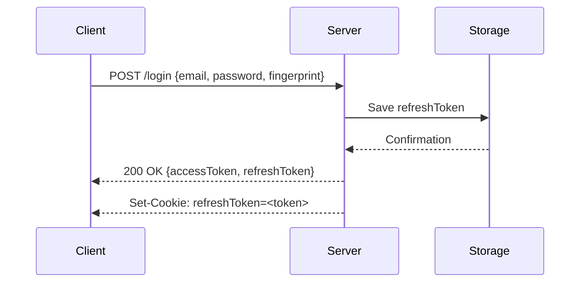
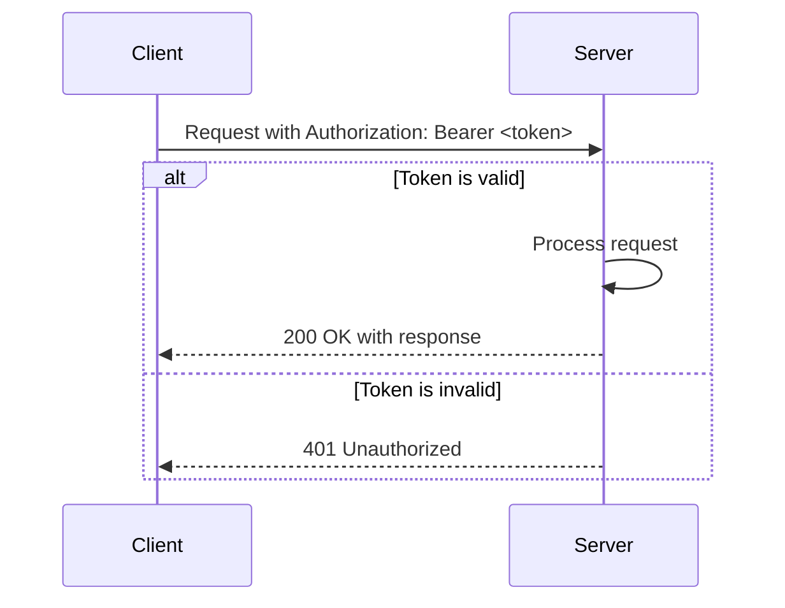
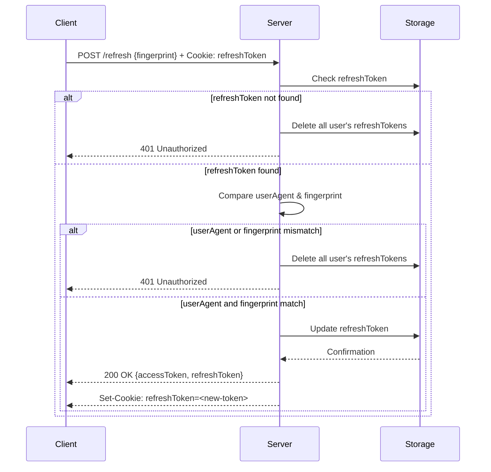
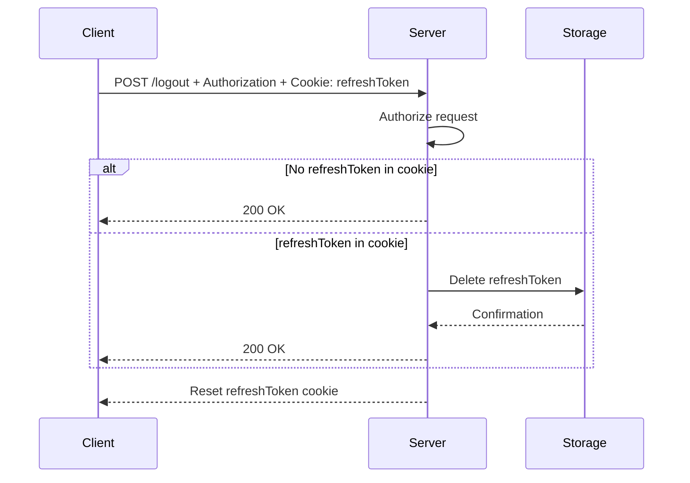
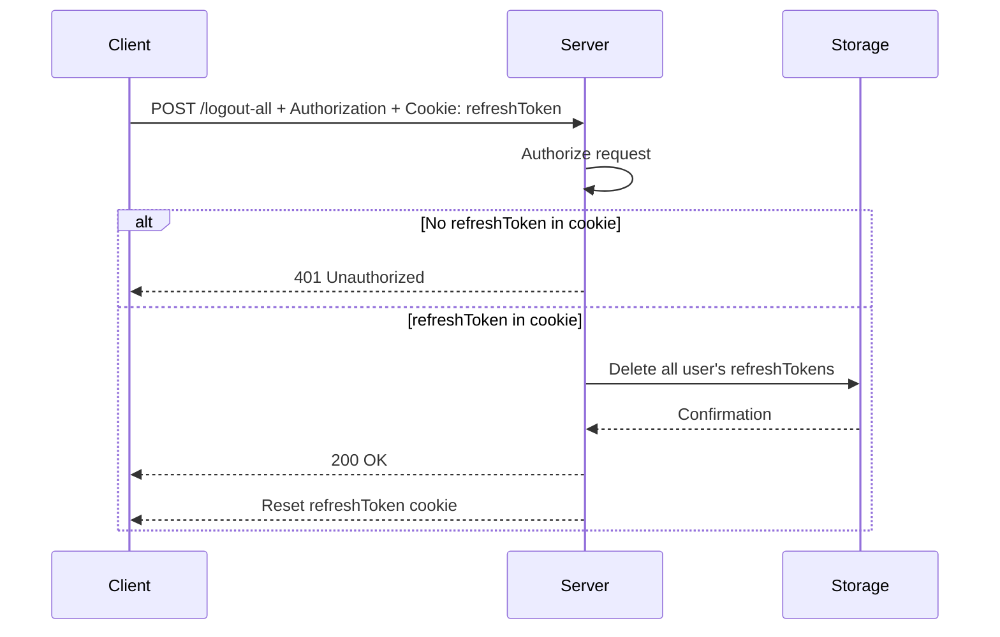

# JWT authorization example on golang

Run whole system using command: `make infra`

Swagger docs located by url: https://jwt-auth-api.abazbekov.ru/swagger/index.html

## Frontend

- https://github.com/GravityTwoG/react-jwt-auth

## Flow

### Authentication Flow

Client makes POST response with:

```typescript
body: {
  email: string;
  password: string;
  fingerprint: string; (browser, device fingerprint or some persistent id stored on device)
}
```

Server checks login credentials.
Server creates pair of accessToken and refreshToken. Server saves refreshToken in persistent storage and responds with:

```typescript
body: {
  accessToken: string;
  refreshToken: string; (for those clients, who doesn't support cookies)
}
header: Set-Cookie: refreshToken=<token>, Domain, Path ...
```

Client should store either only the accessToken or both the accessToken and refreshToken.



### Authorization Flow

Client must pass header Authorization: Bearer <token> in each request that should be authorized.

```typescript
header Authorization: Bearer<token>;
```

Server checks this token without accessing the database or any other storage:

- If token is valid, the request is passed to the endpoint handler.
- If token is not valid, the server responds with HTTP 401 Unauthorized.



### Refresh Tokens Flow

Client makes POST request with:

```typescript
body: {
  fingerprint: string;
}
header Cookie: refreshToken=abc ...
```

Server checks refreshToken.
Server checks for the presence of the refreshToken in persistent storage.
If refreshToken not found in storage, then server deletes all refreshTokens of current user from storage. (The refreshToken may have been stolen)

Server compares the userAgent of the request and the passed fingerprint with the stored userAgent and fingerprint. If they are not equal, then the server deletes all refreshTokens of the current user.

In other cases:
Server creates a pair of accessToken and refreshToken. Server updates the refreshToken in persistent storage and responds with:

```typescript
body: {
  accessToken: string;
  refreshToken: string; (for those clients, who doesn't support cookies)
}
header: Set-Cookie: refreshToken=<token>, Domain, Path ...
```



### Logout Flow

Client makes POST request with:

```typescript
header Cookie: refreshToken=abc ...
header Authorization: Bearer <token>
```

Server authorizes request.
Server checks presence of cookie with refreshToken and:

- if there is no refreshToken, then server responds with HTTP 200 OK
- if there is refreshToken, then server deletes refreshToken from its storage and responds with HTTP 200 OK.

In both cases server also resets refreshToken cookie.



### Logout All Flow

Client makes POST request with:

```typescript
header Cookie: refreshToken=abc ...
header Authorization: Bearer <token>
```

Server authorizes request.
Server checks presence of cookie with refreshToken and:

- if there is no refreshToken, then server responds with HTTP 401 Unauthorized
- if there is refreshToken, then server deletes all refreshTokens of current user and responds with HTTP 200 OK. Server also resets refreshToken cookie.



## Development

### Prerequisites

```sh
# install golangci-lint
curl -sSfL https://raw.githubusercontent.com/golangci/golangci-lint/master/install.sh | sh -s -- -b $(go env GOPATH)/bin v1.59.1
```

### Generate RSA keys (you can do this using OpenSSL):

```sh
openssl genrsa -out private.pem 2048
openssl rsa -in private.pem -pubout -out public.pem
```

Encode the PEM files as Base64:

```sh
export JWT_PRIVATE_KEY=$(cat private.pem | base64 -w 0)
```

### Folder structure

- cmd - entry files for rest-api and migrator
- internal - internal packages
- - rest-api
- - - config - load config from .env
- - - database - db context
- - - models - database models
- - - repositories - data access layer
- - - entities - domain specific
- - - services - domain specific services
- - - controllers - REST controllers
- - - dto - Data transfer objects
- deployments - docker and docker compose files
- docs - swagger docs

```

```

```

```
